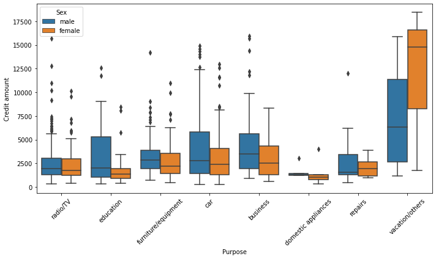
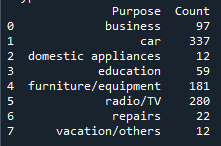
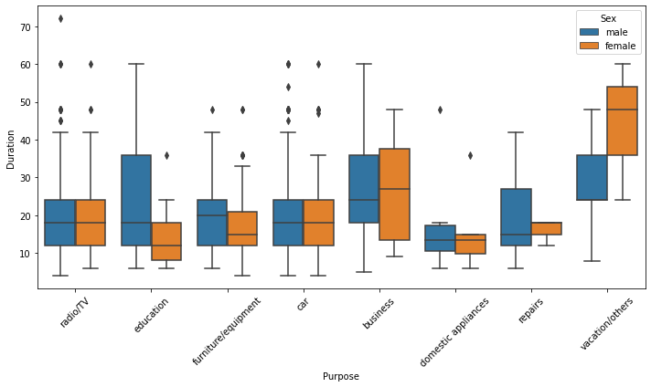
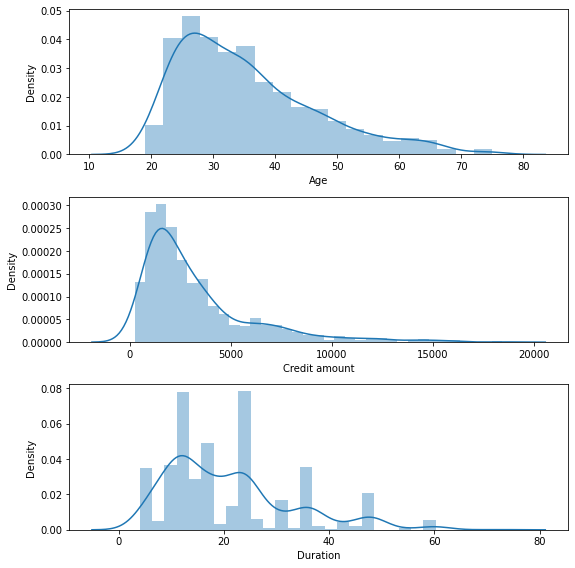
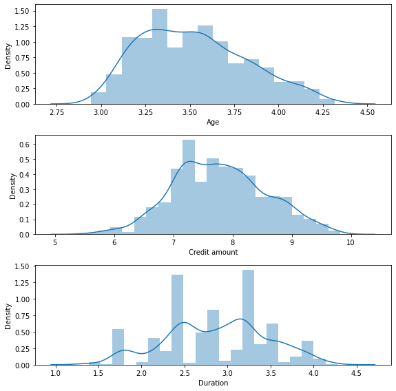
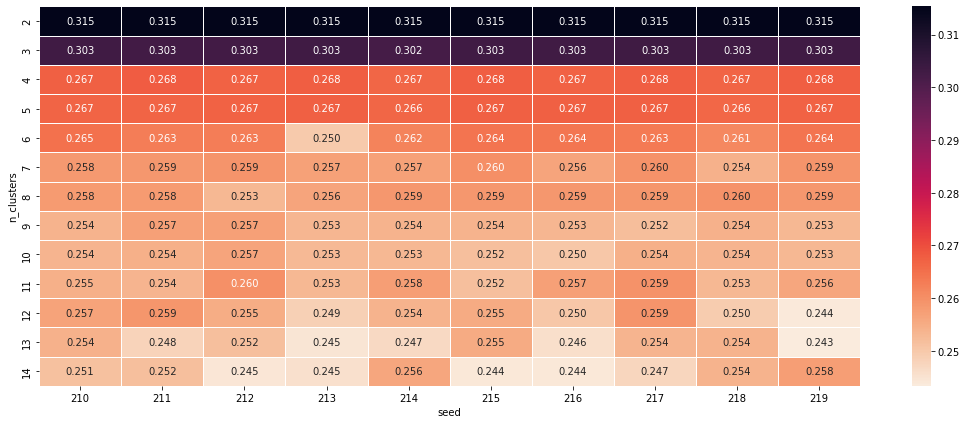

# German Credit Risk Data分析

## 简介

本项目是基于python的pandas和seaborn包完成数据可视化和数据分析工作，数据来源为German Credit Risk Data Set

## 初步分析
```python
print("Missing values in each column:\n{}".format(df.isnull().sum()))

检测文档中的缺失数据，结果如下所示：

Missing values in each column:
Age                   0
Sex                   0
Job                   0
Housing               0
Saving accounts     183
Checking account    394
Credit amount         0
Duration              0
Purpose               0

在Saving accounts和Checking accounts中均有数据缺失，可能是用户并没有创建这两个相关的账户导致数据缺失
```
首先观察用户性别信息，男女客户比约为2:1


接下来看看用户年龄分布图，数据呈现向左倾斜趋势，用户群体多为20-35岁人群


查看用户存款大致信息,绝大多数用户只有少部分存款


在用户开卡目的柱状图中，可以看到大部分用户开卡目的都是与车，广播电视相关


我们接下来分析存款与性别的分布关系,男女不同存款的分布数量大致也为2:1，考虑到数据中的男女比例2:1，可以初步推测性别并不是影响存款数量的重要变量


建立用户账户总额与存款时间的散点图，并以性别作区分，我们观察到与之前相似的关系，性别差异并不会导致账户总额与存款时间关系有太大变化。但是通过观察图像，可以看出账户总额与存款时间大致呈现出一个线性关系，下一个部分将分析他们的线性关系


为了分析其中的线性关系，我将采用皮尔逊相关系数进行假设检验，

原假设 (H₀): 两个变量之间不存在线性相关性,备择假设 (H₁): 两个变量之间存在线性相关性

下图展示了Credit amount和Duration的线性关系，皮尔斯系数为0.62，p-value非常的小，因此我们拒绝原假设的风险非常的小，所有判断两变量之间存在线性关系。其实这个结论也是十分合理的，因为往往大额存款都会选择更长的存款时间以获得更高的利润。


最大的金额是用于度假/其他，最小的是用于家用电器。它们中的大多数在Box的上侧有离群值（更高的金额）。在大多数情况下，男性和女性之间没有差异，除了度假/其他类别。但在度假/其他类别这一类别中授予的贷款数量非常少，因此不太具有分析意义。



在下图中，我们观察不到明显的性别差异对于信用周期变量的作用，我们也无法在各个类别之间看到明显的趋势，但可以观察到家用电器类别的信贷期限是最短的。这是合理的，因为它与前面图表（信贷金额）中的洞察是一致的——在这个类别中，信贷金额是最少的。



## 使用KMeans进行聚类分析

聚类的基本思想是，将大量数据集中相似的数据样本区分出来，并发现不同类的特征。这里选取Age,Credit Amount ,Duration 进行聚类分析

先用直方图观察数据分布,数据呈现向左倾斜趋势,像KMeans这样的基于距离的算法对于特征的尺度和分布非常敏感。倾斜的数据可能会导致某些观察值距离中心点非常远，从而影响聚类的效果。因此我们需要对数据进行log转换消除倾斜趋势
（类似的比如差分求导数，也常用于时间序列的差分使时间序列变平缓方法中）





```python
cluster_log = np.log(cluster_data)
distributions(cluster_log)
```
log转换后数据明显更加呈现一个正态分布的样式，这样比较符合预期，因为许多统计方法和算法都基于数据的正态分布假设。通过对数据进行对数转换或其他方式的转换，可以使数据更接近正态分布，从而满足这些算法的假设，这里也包括Kmeans算法。


接下来需要去寻找一个合适的聚类数目K的值了，首先需要对Age,Credit Amount ,Duration进行归一化处理，使得scale尺度一样
```python
scaler = StandardScaler()
cluster_scaled = scaler.fit_transform(cluster_log)
```

通过观察不同随机种子，生成的聚合点以及其对应的轮廓系数（内聚度/分离度），K=2或者3时，轮廓系数最高。并且随着随机种子改变，他们的轮廓系数非常稳定，几乎没有变化。



