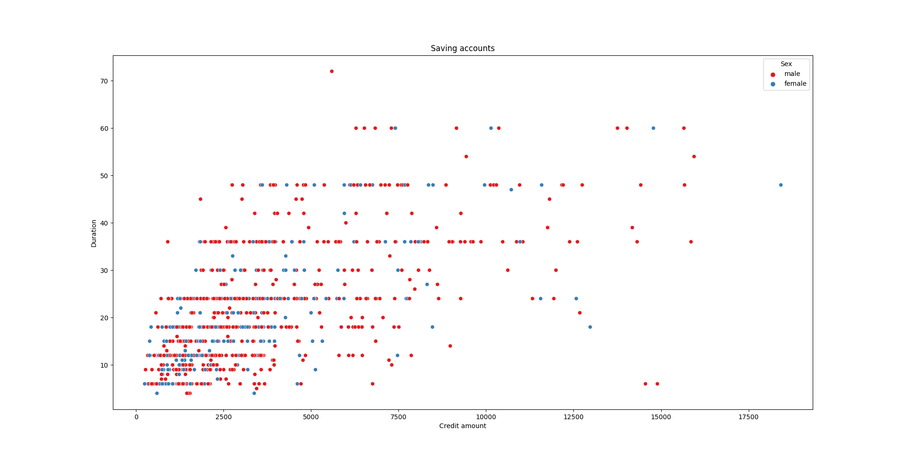
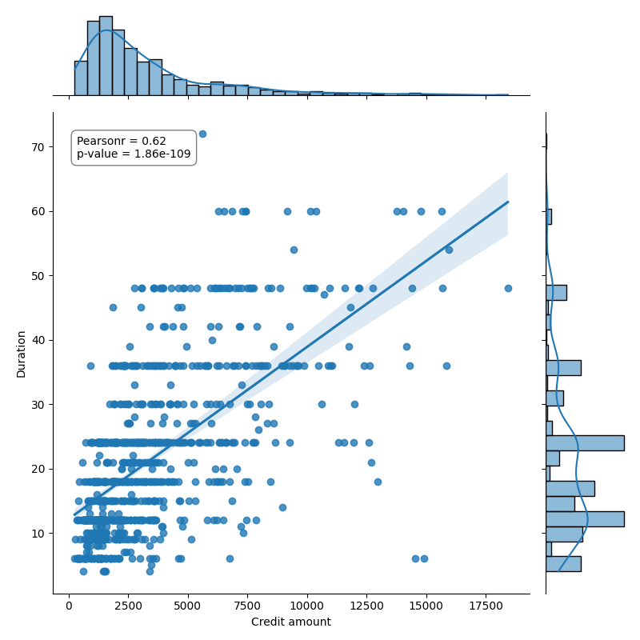

# German Credit Risk Data分析

## 简介

本项目是基于python的pandas和seaborn包完成数据可视化和数据分析工作，数据来源为German Credit Risk Data Set

## 分析报告
```python
print("Missing values in each column:\n{}".format(df.isnull().sum()))

检测文档中的缺失数据，结果如下所示：

Missing values in each column:
Age                   0
Sex                   0
Job                   0
Housing               0
Saving accounts     183
Checking account    394
Credit amount         0
Duration              0
Purpose               0

在Saving accounts和Checking accounts中均有数据缺失，可能是用户并没有创建这两个相关的账户导致数据缺失
```
首先观察用户性别信息，男女客户比约为2:1


接下来看看用户年龄分布图，数据呈现向左倾斜趋势，用户群体多为20-35岁人群


查看用户存款大致信息,绝大多数用户只有少部分存款


我们接下来分析存款与性别的分布关系,男女不同存款的分布数量大致也为2:1，考虑到数据中的男女比例2:1，可以初步推测性别并不是影响存款数量的重要变量


建立用户账户总额与存款时间的散点图，并以性别作区分，我们观察到与之前相似的关系，性别差异并不会导致账户总额与存款时间关系有太大变化。但是通过观察图像，可以看出账户总额与存款时间大致呈现出一个线性关系，下一个部分将分析他们的线性关系


为了分析其中的线性关系，我将采用皮尔逊相关系数进行假设检验，

原假设 (H₀): 两个变量之间不存在线性相关性,备择假设 (H₁): 两个变量之间存在线性相关性

下图展示了Credit amount和Duration的线性关系，皮尔斯系数为0.62，p-value非常的小，因此我们拒绝原假设的风险非常的小，所有判断两变量之间存在线性关系。其实这个结论也是十分合理的，因为往往大额存款都会选择更长的存款时间以获得更高的利润。

